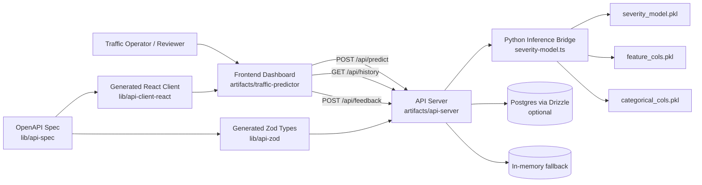
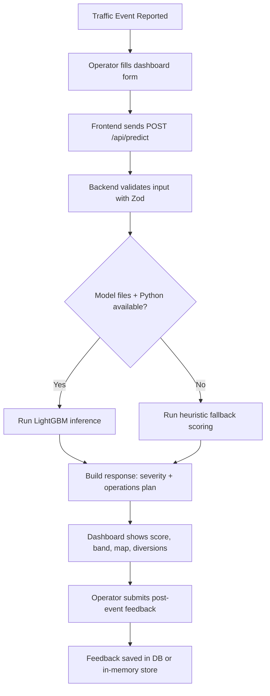

# Traffic Event Predictor

An AI-assisted traffic event impact prediction platform for urban traffic control teams. It predicts event severity and operational needs (police deployment, barricading, diversion guidance, impact radius) and provides a reviewer-friendly dashboard with map-based visualization.

## Project Overview

Traffic incidents such as accidents, vehicle breakdowns, protests, and weather-related disruptions create sudden congestion hotspots. This project helps traffic command teams make faster and more consistent decisions by combining:

- A trained machine learning model for severity prediction.
- Rule-based operational recommendation logic.
- A frontend dashboard for data entry, visualization, and feedback capture.
- Backend APIs for prediction, feedback, and historical analytics.

## Problem Statement

Traffic operations teams need quick, explainable recommendations when an event occurs:

- How severe is the likely impact?
- How many police units and barricade points are needed?
- Which diversions should be activated?
- Which zones/corridors are historically high risk?

Manual decision-making can be inconsistent and slow during peak periods. This system standardizes and speeds up response planning.

## Key Features

- Severity prediction using a trained LightGBM classification model.
- Fallback heuristic prediction when model files/dependencies are unavailable.
- Operational output generation:
	- police units needed
	- barricade points
	- impact radius
	- two diversion routes
	- zone-specific recommended action
- Interactive dashboard with:
	- structured event form
	- prediction card
	- impact map visualization
- Historical analytics endpoints for trend charts (cause, hour, zone).
- Feedback loop endpoints for post-event validation.

## Tech Stack

### Frontend

- React + TypeScript
- Vite
- Tailwind CSS + Radix UI
- React Hook Form + Zod
- React Query
- Leaflet (map visualization)

### Backend

- Node.js + TypeScript
- Express
- Zod validation via generated API schemas
- Drizzle ORM (optional DB mode)
- Pino logging

### ML Inference

- Python 3
- LightGBM model artifact (`severity_model.pkl`)
- Pandas-based feature frame construction

## Dataset Details

Primary dataset file:

- `attached_assets/Astram_event_data_anonymized_-_Astram_event_data_anonymizedb40_1781864556746.csv`

Sample fields (from dataset header):

- `event_type`, `event_cause`, `requires_road_closure`
- `veh_type`, `zone`, `corridor`
- `latitude`, `longitude`
- timestamp and operational metadata columns

Historical analytics in the backend are currently precomputed from an 8,206-row Astram Bangalore event dataset.

## Model Information

Model artifacts (current repo root):

- `severity_model.pkl`
- `feature_cols.pkl`
- `categorical_cols.pkl`

Model summary:

- Model family: LightGBM classifier (`LGBMClassifier`)
- Feature count: 11
- Categorical feature count: 6
- Output used by API:
	- `severity_score` (0-100)
	- `severity_band` (`Low` | `Medium` | `High`)

Backend behavior:

- Uses model inference when model files and Python execution succeed.
- Falls back to deterministic heuristic scoring when inference is unavailable.

## Model Performance Metrics

**Validation Results** (computed from the available dataset and model artifacts in the repository):

- **Model:** LightGBM Classifier
- **Accuracy:** 99.77%
- **F1 Score:** 99.81%

### Model Details

- **Type:** `LGBMClassifier`
- **Learning rate:** `0.05`
- **Number of estimators:** `200`
- **Number of leaves:** `31`
- **Boosting type:** `gbdt`
- **Random state:** `42`
- **Feature columns:** 11
- **Categorical columns:** 6

> **Note:** These validation results were generated from the available project dataset snapshot (`attached_assets/Astram_event_data_anonymized_-_Astram_event_data_anonymizedb40_1781864556746.csv`) using the current model artifacts (severity_model.pkl, feature_cols.pkl, categorical_cols.pkl). Metrics reflect in-repo validation and may differ from strict train/validation benchmark splits.

## Project Architecture



## Project Workflow Diagram



## Repository Structure

```text
Traffic-Event-Predictor/
	artifacts/
		api-server/               # Express backend
			src/
				routes/               # health, predict, feedback, history
				lib/severity-model.ts # Python model bridge
		traffic-predictor/        # React dashboard frontend
			src/
				pages/
				components/tabs/
	lib/
		api-spec/                 # OpenAPI source
		api-zod/                  # Generated request/response schemas
		api-client-react/         # Generated frontend API client
		db/                       # Drizzle schema and DB setup
	attached_assets/
		Astram_event_data_...csv  # Dataset
	severity_model.pkl          # Trained model artifact
	feature_cols.pkl
	categorical_cols.pkl
```

## Installation and Setup

### Prerequisites

- Node.js 20+
- pnpm 9+
- Python 3.10+

### 1. Install workspace dependencies

```bash
pnpm install
```

### 2. Install Python dependencies for inference

Use the Python interpreter available in your environment:

```bash
python -m pip install pandas lightgbm scikit-learn joblib
```

If `python` is not recognized, use `python3` (Linux/macOS) or full Python path (Windows).

### 3. Optional database setup

The backend supports two modes:

- With `DATABASE_URL`: persists feedback in PostgreSQL.
- Without `DATABASE_URL`: uses in-memory fallback for local/demo usage.

## How to Run (Frontend + Backend)

Open two terminals from the repository root.

### Terminal 1: Start backend (port 5000)

Windows PowerShell:

```powershell
$env:PORT = "5000"
pnpm --filter @workspace/api-server run dev
```

macOS/Linux:

```bash
PORT=5000 pnpm --filter @workspace/api-server run dev
```

### Terminal 2: Start frontend (port 3000)

```bash
pnpm --filter @workspace/traffic-predictor run dev
```

Then open:

- `http://localhost:3000`

Note: frontend dev server proxies `/api` to `http://localhost:5000`.

## API Endpoints

Base path: `/api`

### Health

- `GET /healthz`
- Response: `{ "status": "ok" }`

### Predict

- `POST /predict`
- Request body:

```json
{
	"event_type": "unplanned",
	"event_cause": "accident",
	"requires_road_closure": true,
	"veh_type": "private_car",
	"zone": "Central Zone 1",
	"corridor": "CBD 1",
	"latitude": 12.9716,
	"longitude": 77.5946,
	"hour": 9,
	"day_of_week": 0,
	"month": 6
}
```

- Response includes:
	- `severity_score`, `severity_band`
	- `police_units_needed`, `barricade_points`
	- `diversion_route_1`, `diversion_route_2`
	- `recommended_action`, `impact_radius_meters`

### Feedback

- `POST /feedback` to submit post-event outcome.
- `GET /feedback` to list feedback entries.

### Historical Analytics

- `GET /history` returns aggregated chart data.
- `GET /history/stats` returns summary metrics.

## Reviewer Quick Check

1. Start backend on `5000` and frontend on `3000`.
2. Open dashboard and submit default form in Predict tab.
3. Confirm prediction card updates with severity, deployment numbers, and diversion routes.
4. Confirm map shows event marker + impact zone.
5. Optionally verify API directly:

```bash
curl -X GET http://localhost:5000/api/healthz
```

## Future Enhancements

- Add online retraining pipeline with drift detection.
- Store and version model artifacts in a dedicated model registry.
- Add model explainability (SHAP/feature contribution view).
- Add real-time traffic feed integration (streaming events).
- Add geospatial route optimization for diversion recommendations.
- Add role-based access and audit logs for command-center workflows.
- Expand evaluation suite with confusion matrix and calibration metrics.

## Team Members and Contributions

Use this section for your submission deck and replace placeholders with actual names.

| Team Member | Role | Key Contributions |
| --- | --- | --- |
| Member 1 | ML Engineer | Data preparation, feature engineering, LightGBM training, model artifact export |
| Member 2 | Backend Engineer | API development, inference integration, validation, fallback logic |
| Member 3 | Frontend Engineer | Dashboard UI, map visualization, API integration, UX polish |
| Member 4 | Data/QA Engineer | Dataset analysis, testing, feedback loop validation, documentation |

## Workspace Commands

```bash
pnpm run typecheck
pnpm run build
pnpm --filter @workspace/api-server run dev
pnpm --filter @workspace/traffic-predictor run dev
```